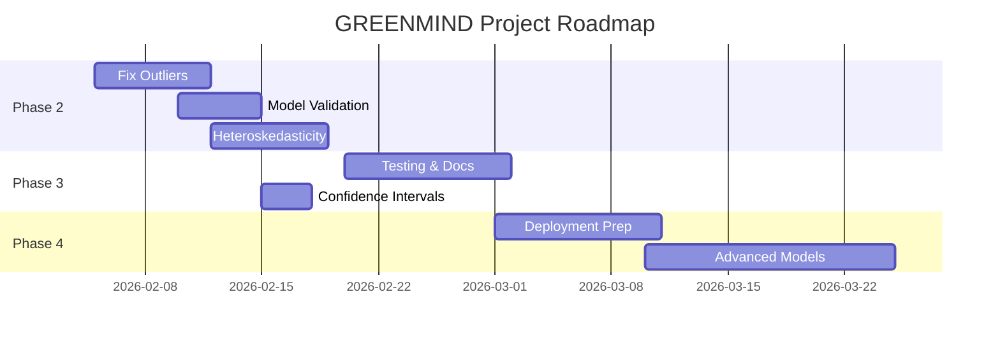

# 🔴 VẤN ĐỀ TỒN ĐỌNG - DỰ ÁN GREENMIND

**Ngày cập nhật:** 2026-02-05  
**Trạng thái dự án:** Phase 2 - Modeling (80% hoàn thành)

---

## 📋 TÓM TẮT NHANH

| Loại vấn đề        | Số lượng | Mức độ ưu tiên cao |
| ------------------ | -------- | ------------------ |
| 🔴 Critical        | 0        | 0                  |
| 🟠 High Priority   | 3        | 3                  |
| 🟡 Medium Priority | 5        | -                  |
| 🟢 Low Priority    | 4        | -                  |
| **Tổng**           | **12**   | **3**              |

---

## 🔴 CRITICAL ISSUES (Blocking - Cần fix ngay)

**Không có vấn đề critical.**

---

## 🟠 HIGH PRIORITY (Quan trọng - Nên fix tuần này)

### 1. **Model không bắt được Outliers/Flash Sales**

**Module:** `notebooks/modeling/02_demand_forecasting_ARIMA_v2_FIXED.ipynb`

**Vấn đề:**

- ARIMA forecast phẳng lỳ (332-346 units trong 14 ngày)
- Không dự báo được spike 2500+ (flash sale events)
- MAE: 351 units (~44% mean stock) - Cao

**Nguyên nhân:**

- ARIMA là mô hình tuyến tính, không học được sự kiện bất thường
- Không có external features (flash sale flag, discount level)

**Giải pháp đề xuất:**

```python
# Option 1: Outlier Removal
ts_stock_cleaned = ts_stock[ts_stock < ts_stock.quantile(0.95)]

# Option 2: Add External Regressors
SARIMAX(endog=stock, exog=discount_level, order=(2,1,2))

# Option 3: Ensemble Model
forecast = 0.6 * ARIMA_pred + 0.4 * Prophet_pred
```

**Deadline:** 2026-02-12  
**Assigned to:** Modeling Team

---

### 2. **Heteroskedasticity trong Time Series**

**Module:** `notebooks/modeling/02_demand_forecasting_ARIMA_v2_FIXED.ipynb`

**Vấn đề:**

- Ljung-Box H test: 7.71 (variance không đồng nhất)
- Forecast confidence interval không chính xác
- Phần đầu chuỗi biến động mạnh (0-2500), phần sau ổn định (200-800)

**Nguyên nhân:**

- Có structural break trong dữ liệu (thay đổi strategy stock)
- 2 chế độ khác nhau: High volatility period vs Stable period

**Giải pháp đề xuất:**

```python
# Split time series into regimes
regime1 = ts_stock[ts_stock.index < '2022-08-01']  # High volatility
regime2 = ts_stock[ts_stock.index >= '2022-08-01']  # Stable

# Train separate models OR use GARCH for volatility
from arch import arch_model
model_garch = arch_model(ts_stock, vol='GARCH', p=1, q=1)
```

**Deadline:** 2026-02-19  
**Assigned to:** Modeling Team

---

### 3. **Thiếu Model Validation cho các sản phẩm khác**

**Module:** `notebooks/modeling/`

**Vấn đề:**

- Chỉ test trên 1 sản phẩm (7743986580)
- Chưa biết model perform thế nào trên 4 sản phẩm còn lại
- Chưa có cross-validation strategy

**Giải pháp đề xuất:**

```python
# Loop qua tất cả products
for product_id in df['itemid'].unique():
    model = ARIMA(product_data, order=(2,1,2))
    results = evaluate_model(model)
    save_report(product_id, results)

# Tạo comparative report
generate_comparison_table(all_results)
```

**Deadline:** 2026-02-15  
**Assigned to:** Modeling Team

---

## 🟡 MEDIUM PRIORITY (Cần làm - Trong tháng này)

### 4. **Data Quality Issues**

**Module:** `data/processed/Price_Stock_History.csv`

**Vấn đề:**

- Cột `discount` vẫn ở dạng float (0.45) thay vì % (45%) - Inconsistent
- Không có validation cho giá trị âm trong stock
- Missing value handling chưa rõ ràng

**Giải pháp:**

```python
# Add validation in preprocessing
assert (df['stock'] >= 0).all(), "Negative stock detected"
assert (df['price'] > 0).all(), "Invalid price"

# Standardize discount format
df['discount_pct'] = df['discount'] * 100  # 45%
```

**Deadline:** 2026-02-20

---

### 5. **Thiếu Automated Testing**

**Module:** `tests/`

**Vấn đề:**

- Thư mục `tests/` rỗng
- Không có unit test cho data processing
- Không có integration test cho model pipeline

**Giải pháp:**

```python
# tests/test_forecasting.py
def test_stock_never_negative():
    forecast = model.forecast(steps=14)
    assert (forecast >= 0).all()

def test_model_convergence():
    model = ARIMA(train, order=(2,1,2))
    result = model.fit()
    assert result.mle_retvals['converged'] == True
```

**Deadline:** 2026-02-25

---

### 6. **Documentation chưa đầy đủ**

**Module:** `docs/`, `README.md`

**Vấn đề:**

- README.md không có hướng dẫn reproduce results
- Thiếu API documentation cho `src/models/demand_forecasting.py`
- Không có architecture diagram

**Giải pháp:**

- Viết step-by-step guide
- Generate API docs bằng Sphinx
- Vẽ flowchart cho data pipeline

**Deadline:** 2026-03-01

---

### 7. **Forecast Output không có Confidence Interval**

**Module:** `notebooks/modeling/02_demand_forecasting_ARIMA_v2_FIXED.ipynb`

**Vấn đề:**

- Chỉ có point forecast (346 units)
- Không có upper/lower bounds
- Không thể assess uncertainty

**Giải pháp:**

```python
# Get prediction interval
forecast_result = fitted_model.get_forecast(steps=14)
forecast_df['predicted'] = forecast_result.predicted_mean
forecast_df['lower_ci'] = forecast_result.conf_int()['lower stock']
forecast_df['upper_ci'] = forecast_result.conf_int()['upper stock']

# Plot with CI bands
plt.fill_between(dates, lower_ci, upper_ci, alpha=0.3)
```

**Deadline:** 2026-02-18

---

### 8. **Chưa có Deployment Plan**

**Module:** `deployment/`, `docker/`

**Vấn đề:**

- Model chỉ chạy trong Jupyter Notebook
- Chưa có production-ready script
- Không có Docker container

**Giải pháp:**

- Chuyển notebook → Python script
- Tạo FastAPI endpoint cho prediction
- Dockerize application

**Deadline:** 2026-03-10

---

## 🟢 LOW PRIORITY (Nice to have - Future work)

### 9. **Thử các mô hình tiên tiến hơn**

**Module:** `notebooks/modeling/`

**Đề xuất:**

- Prophet (Facebook): Better seasonality handling
- LSTM/GRU: Deep learning approach
- XGBoost: Feature-rich model
- Ensemble: Combine multiple models

**Deadline:** 2026-03-15

---

### 10. **Tối ưu Performance**

**Module:** Toàn bộ codebase

**Vấn đề:**

- Resample daily có thể chậm với dataset lớn
- Không có caching cho intermediate results
- Model training có thể song song hóa

**Giải pháp:**

```python
# Use Dask for large datasets
import dask.dataframe as dd
df = dd.read_csv('data.csv')

# Cache intermediate results
@lru_cache(maxsize=128)
def preprocess_product(item_id):
    ...
```

**Deadline:** 2026-04-01

---

### 11. **Alert System cho Low Stock**

**Module:** `src/alerts/`

**Đề xuất:**

- Email alert khi forecast < threshold
- Slack/Teams integration
- Auto-generate purchase order

**Deadline:** 2026-03-20

---

### 12. **Dashboard/Visualization**

**Module:** `dashboards/`

**Đề xuất:**

- Streamlit/Dash app
- Real-time stock monitoring
- Interactive forecasting tool

**Deadline:** 2026-04-15

---

## 📊 TIẾN ĐỘ TỔNG QUAN

### ✅ Đã hoàn thành:

- [x] Data preprocessing (V3)
- [x] Product Master & History split
- [x] UTF-8 encoding fix
- [x] ARIMA model training
- [x] Restock threshold logic
- [x] Jupyter Notebook documentation

### 🚧 Đang làm:

- [ ] Fix outlier handling (Issue #1)
- [ ] Multi-product validation (Issue #3)

### 📅 Kế hoạch:

- **Tuần 1 (2026-02-05 → 02-12):** Fix High Priority issues
- **Tuần 2-3 (02-12 → 02-28):** Medium Priority issues
- **Tháng 3:** Low Priority improvements

---

## 🎯 ROADMAP TỔNG THỂ



---

## 💡 KHUYẾN NGHỊ

### Ưu tiên cao nhất (Tuần này):

1. **Issue #1:** Fix outlier handling → Improve MAE
2. **Issue #3:** Validate trên nhiều sản phẩm → Tăng độ tin cậy

### Tác động lớn nhất:

- **Issue #7:** Thêm Confidence Interval → Business có thể assess risk
- **Issue #11:** Alert system → Giá trị thực tế cao

### Quick wins (1-2 giờ):

- **Issue #4:** Data validation
- **Issue #7:** CI bands

---

## 📞 LIÊN HỆ

**Project Lead:** [Your Name]  
**Email:** [email]  
**Last Updated:** 2026-02-05 18:27:00

---

**Ghi chú:** Document này sẽ được cập nhật hàng tuần. Mỗi issue được fix sẽ được move sang `CHANGELOG.md`.
