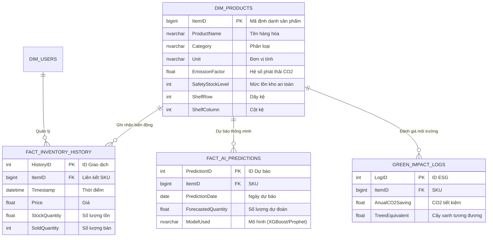

# Kiến trúc Kỹ thuật Hệ thống GreenMind AI

Tài liệu này mô tả cấu trúc dữ liệu và kiến trúc hệ thống của dự án GreenMind AI.

## 1. Sơ đồ Thực thể Quan hệ (ERD)

Sơ đồ này mô tả cách các bảng trong SQL Server kết nối với nhau.

## 2. Kiến trúc 3 Tầng (3-Tier Architecture)

Hệ thống được thiết kế theo mô hình phân lớp để đảm bảo tính mở rộng và bảo mật.

### Tầng 1: Data Layer (Lớp Dữ liệu)

- **Công nghệ:** Microsoft SQL Server.
- **Chức năng:** Lưu trữ tập trung dữ liệu Master Data và các bảng Fact. Đảm bảo tính toàn vẹn thông qua Constraints và Triggers.

### Tầng 2: Intelligence Layer (Lớp Trí tuệ AI)

- **Công nghệ:** Python, XGBoost, Scikit-learn, Pandas.
- **Chức năng:**
  - Truy xuất dữ liệu từ SQL thông qua SQLAlchemy.
  - Xử lý đặc trưng (Feature Engineering).
  - Chạy mô hình học máy để đưa ra con số dự báo 30 ngày.

### Tầng 3: Presentation Layer (Lớp Hiển thị)

- **Công nghệ:** Django Framework, Plotly, Tailwind CSS.
- **Chức năng:**
  - Dashboard quản trị Dark Mode.
  - Biểu đồ tương tác thời gian thực.
  - Hệ thống Quản lý Danh mục và Mô phỏng Giao dịch.

---

_Tài liệu này được tạo tự động bởi trợ lý GreenMind AI._
